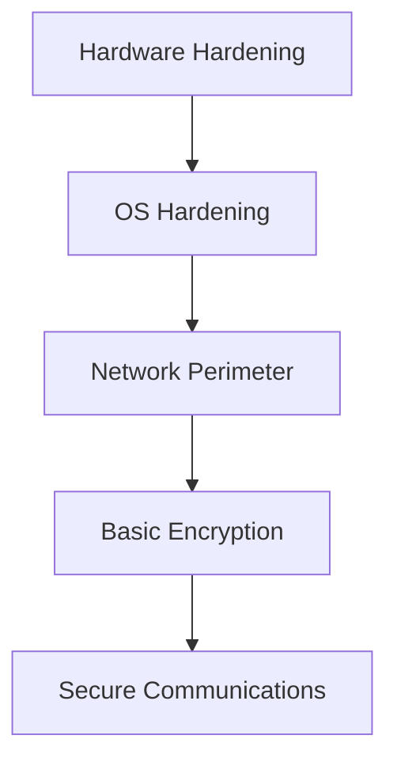

# 🛡️ Guía de Seguridad Digital: Defensa en Profundidad y Zero Trust

## 🧠 Filosofía de Seguridad

La seguridad no es un producto, es un proceso. Cada capa añadida multiplica exponencialmente la resistencia del sistema. Un atacante debe comprometer TODAS las capas para tener éxito. La filosofía Zero Trust se basa en no confiar en nada por defecto y verificar siempre.

### Principios Clave
*   **No confiar por defecto**: Autenticación para cada dispositivo y usuario.
*   **Acceso mínimo necesario**: Limitar permisos por dispositivo.
*   **Segmentación de red**: Separar dispositivos por función.
*   **Monitoreo continuo**: Detectar actividad sospechosa.
*   **Autenticación fuerte**: Verificación constante de identidad.

---

## 🧱 Arquitectura de Seguridad: Modelo de Capas

Una buena arquitectura de seguridad se basa en la defensa en profundidad, donde múltiples capas de seguridad protegen los activos.



### Arquitectura Final Tipo "Dark Army"

```mermaid
graph TD
    subgraph Internet Hostil
        A[Internet]
    end

    subgraph Perímetro
        B[ISP Modem en modo Bridge] --> C{🛡️ pfSense Firewall + IDS/IPS};
    end

    subgraph Red Interna Segmentada
        C --> D[🔀 Managed Switch];
        D --> V10[VLAN 10: Management];
        D --> V20[VLAN 20: Trabajo Confiable];
        D --> V30[VLAN 30: IoT No Confiable];
        D --> V40[VLAN 40: Invitados Aislados];
        D --> V50[VLAN 50: Honeypots & Trampas];
    end
    
    subgraph Endpoints y Servicios
        V10 --> E[🧠 SIEM + Pi-hole];
        V20 --> F[💻 Workstations];
        V50 --> G[🍯 Honeypots];
    end

    subgraph Aislamiento en Workstation
        F --> H[Qubes OS];
        H --> I[VM de Trabajo];
        H --> J[VM de Navegación Anónima - Whonix];
        H --> K[VM de Vault - KeePassXC];
    end

    subgraph Almacenamiento y Recuperación
        L[💾 Backups Offline Cifrados]
    end

    style L fill:#111,stroke:#000,stroke-width:2px
```



---

## 🖥️ Dominio 1: Infraestructura y Sistema Base

### Sistemas Operativos Seguros

| Sistema Operativo | Característica Principal | Uso Ideal | Persistencia | Requiere Instalación |
|---|---|---|---|---|
| **Qubes OS** | Aislamiento total por VM | Seguridad extrema, compartimentalización | Sí | Instalación dedicada |
| **Tails OS** | No guarda datos, todo pasa por Tor | Activismo, periodismo, navegación anónima | Opcional | USB booteable |
| **Whonix** | VM dividida en Gateway (Tor) y Workstation | Anonimato en entorno virtualizado | Sí | VirtualBox / KVM |
| **GrapheneOS** | Android hardened, sin Google tracking | Móvil seguro | Sí | Pixel |
| **CalyxOS** | Android privado con microG | Móvil seguro | Sí | Pixel |
| **PureOS (Live)** | Basado en Debian, enfocado en privacidad | Uso general con enfoque ético | Sí | USB o disco |

### Virtualización y Sandboxing

| Herramienta | Plataforma | Uso Básico | Propósito |
|---|---|---|---|
| **VirtualBox** | Win/Linux/macOS | Crear VMs para aislamiento de tareas, snapshots, red interna. | Laboratorio controlado |
| **KVM / QEMU** | Linux | Virtualización nativa, ideal para servidores y entornos productivos. | Virtualización de alto rendimiento |
| **Firejail** | Linux | `firejail firefox` | Aislar apps por perfil |
| **Flatpak** | Linux | `flatpak run org.mozilla.firefox` | Contenedor seguro |
| **Windows Sandbox**| Windows Pro/Ent | Ejecutar entorno aislado temporal | Pruebas seguras |

### Guía de Instalación y Uso de Herramientas Clave

#### Qubes OS
- **Descarga**: [qubes-os.org/downloads](https://www.qubes-os.org/downloads/)
- **Instalación**: [Guía paso a paso con capturas](https://computingforgeeks.com/install-qubes-os-step-by-step-with-screenshots/)
- **Uso básico**: Aislamiento por qubes (VMs), cada uno con propósito distinto. Ideal para tareas separadas como navegación, pentesting, correo.

#### Tails OS
- **Descarga**: [tails.net/install](https://tails.net/install/)
- **Instalación**: USB booteable con Etcher o Rufus. [Guía oficial](https://tails.net/install/windows/)
- **Uso básico**: Navegación anónima por Tor, no deja rastros en el sistema. Ideal para sesiones temporales.

#### Whonix
- **Descarga**: [whonix.org/wiki/Download](https://www.whonix.org/wiki/Download)
- **Instalación**: Importar Gateway y Workstation en VirtualBox. [Guía detallada](https://www.techiemike.com/a-step-by-step-guide-to-setting-up-whonix-for-enhanced-internet-privacy/)
- **Uso básico**: Todo el tráfico pasa por Tor. Gateway maneja red, Workstation ejecuta apps.

#### GrapheneOS
- **Descarga**: [grapheneos.org/install](https://grapheneos.org/install/)
- **Instalación**: WebUSB installer desde navegador Chromium. Solo para dispositivos Pixel compatibles.
- **Uso básico**: Android hardened, sin Google. Auditor, Vanadium, control granular de permisos.

---

## 🌐 Dominio 2: Perímetro de Red y Conectividad

### Firewall

| Herramienta | Nivel | Uso Básico |
|---|---|---|
| **UFW** | Básico | `sudo ufw default deny incoming` |
| **pfSense** | Avanzado | Firewall completo, NAT, VPN, VLAN, reglas granulares. |
| **OpenWRT** | Avanzado | Router personalizado, SPAN port, VLAN, QoS, firewall extendido. |

### VPN y DNS

| Elemento | Recomendación Máxima Seguridad | Justificación Técnica |
|---|---|---|
| **VPN** | Mullvad / ProtonVPN / VPN propio en VPS | Sin logs, IP dinámica, túnel cifrado |
| **DNS Seguro** | DNSCrypt / DoH con NextDNS o Pi-hole | Evita filtrado ISP y rastreo por DNS |
| **Red WiFi** | WPA3, SSID oculto, MAC filtering | Reduce vectores de ataque locales |

### Guía de Instalación y Uso de Herramientas Clave

#### pfSense
- **Descarga**: [pfsense.org/download](https://www.pfsense.org/download/)
- **Instalación**: USB booteable, interfaz web. [Guía oficial](https://docs.netgate.com/pfsense/en/latest/install/install-walkthrough.html)
- **Uso básico**: Firewall completo, NAT, VPN, VLAN, reglas granulares.

#### OpenWRT
- **Descarga**: [openwrt.org](https://openwrt.org/)
- **Instalación**: Flashear firmware específico del router. [Guía rápida](https://openwrt.org/docs/guide-quick-start/start)
- **Uso básico**: Router personalizado, SPAN port, VLAN, QoS, firewall extendido.

#### Servidor de Red Virtualizado (VPN + Pi-hole)
- **Concepto**: En lugar de usar hardware dedicado como una Raspberry Pi, se puede lograr el mismo resultado con una máquina virtual (VM) ligera en un PC que esté siempre encendido. Esto proporciona un servidor de red aislado para filtrar DNS y gestionar tu propia VPN sin coste de hardware adicional.
- **1. Crear la VM**: Usa VirtualBox o KVM para crear una VM con un sistema operativo ligero como **Debian Server** o **Ubuntu Server** (instalación mínima). Asigna recursos modestos (1-2 CPU, 1-2 GB RAM, 20 GB de disco).
- **2. Configurar la Red**: **CRÍTICO:** Configura el adaptador de red de la VM en modo **Puente (Bridged Adapter)**. Esto le dará a la VM su propia IP en tu red local, como si fuera un dispositivo físico. Asígnale una IP estática dentro de la VM.
- **3. Instalar Software (dentro de la VM)**:
    - **Pi-hole Setup**: Sigue la guía oficial en [pi-hole.net](https://pi-hole.net/).
    - **VPN Setup**: Instala un servidor VPN. El script de [PiVPN para WireGuard](https://www.youtube.com/watch?v=DUpIOSbbvKk) funciona perfectamente en Debian/Ubuntu.
- **Uso básico**: El resultado es el mismo: una red local filtrada, DNS seguro y un nodo VPN propio, todo corriendo de forma aislada en una VM.

---

## 🔐 Dominio 3: Criptografía y Gestión de Datos

### Cifrado de Archivos y Discos

| Herramienta | Sistema Compatible | Uso Básico | Nivel de Seguridad |
|---|---|---|---|
| **BitLocker** | Windows Pro/Ent | Activar → Elegir PIN → Guardar clave de recuperación | Alto |
| **LUKS (dm-crypt)**| Linux | Cifrado completo con passphrase en arranque | Muy alto |
| **VeraCrypt** | Win/Linux/macOS | Crear volumen → Montar → Usar como disco normal | Alto |
| **GPG** | Win/Linux/macOS | `gpg --encrypt --recipient user file.txt` | Alto (manual) |

### Gestores de Contraseñas y Autenticación

| Elemento | Recomendación Máxima Seguridad | Justificación Técnica |
|---|---|---|
| **Autenticación** | 2FA físico (YubiKey), SSH Keys, contraseñas únicas | Evita phishing, acceso no autorizado |
| **Gestor de Contraseñas** | KeePassXC / Bitwarden (self-hosted) | Vault cifrado, sin dependencia de terceros |

### Transferencia de Archivos

| Herramienta | Propósito Principal | Uso Básico | Nivel de Anonimato |
|---|---|---|---|
| **Magic Wormhole** | Transferencia segura de archivos | `wormhole send file.txt` → `wormhole receive code` | Alto (peer-to-peer) |
| **OnionShare** | Compartir archivos y chat anónimos | Arrastrar archivo → Generar link `.onion` | Muy alto |
| **Syncthing** | Sincronización privada de archivos | Añadir carpeta → Compartir con otro dispositivo | Medio–Alto |

---

## 🕵️ Dominio 4: Navegación y Anonimato

### Navegadores y Extensiones

| Elemento | Recomendación Máxima Seguridad | Justificación Técnica |
|---|---|---|
| **Navegador Web** | Tor Browser / Firefox Hardened | Tor para anonimato, Firefox con configuración estricta |
| **Extensiones clave** | uBlock Origin, NoScript, HTTPS Everywhere | Bloqueo de scripts, rastreadores y conexiones inseguras |

### Evasión de Fingerprinting

| Técnica | Descripción | Herramientas / Acciones Recomendadas |
|---|---|---|
| **Uniformidad de huella** | Usar configuraciones genéricas para parecerse a muchos usuarios | Tor Browser (todos los usuarios comparten fingerprint) |
| **Spoofing activo** | Alterar manualmente User-Agent, WebGL, Canvas, etc. | `CanvasBlocker`, `User-Agent Switcher`, `Trace`, `Chameleon` |
| **Bloqueo de scripts** | Evitar que scripts recopilen datos del navegador | `NoScript`, `uBlock Origin`, `Privacy Badger` |
| **Navegadores modificados** | Usar navegadores diseñados para evadir fingerprinting | Brave (con fingerprint randomization), LibreWolf |

---

## 💬 Dominio 5: Comunicaciones Seguras

### Mensajería y Correo

| Herramienta | Propósito Principal | Nivel de Anonimato | Requiere Tor |
|---|---|---|---|
| **Signal** | Mensajería cifrada | Alto (metadatos mínimos) | No |
| **Session** | Mensajería anónima sin número | Muy alto | Sí (usa red onion propia) |
| **Element (Matrix)** | Mensajería descentralizada | Medio–Alto | Opcional |
| **ProtonMail** | Correo electrónico cifrado | Alto | No |
| **Tutanota** | Correo electrónico cifrado | Alto | No |

## **🛡️ Dominio 6: Detección, Respuesta y Defensa Activa (Versión Completa y Corregida)**

Este dominio cubre las herramientas y técnicas para monitorear activamente el sistema, detectar anomalías que puedan indicar un compromiso y responder a incidentes de seguridad.

### **6.1 Defensa Proactiva y Automatizada**

Esta sección se enfoca en las herramientas y estrategias que se configuran para prevenir, detectar y alertar sobre amenazas de forma continua.

#### **6.1.1 Herramientas de Detección de Intrusos (HIDS)**

| Herramienta | Tipo | Uso Básico | Nivel de Visibilidad |
| :--- | :--- | :--- | :--- |
| **OSSEC** | HIDS (Linux/Win) | Monitorea logs, integridad, alertas por correo | Alta |
| **CrowdSec** | HIDS + Remediación | Detecta ataques → Bouncer bloquea IPs | Muy alta |
| **Auditd** | Linux | Monitorea syscalls, accesos, cambios críticos | Alta |
| **Fail2Ban** | Linux | Detecta brute force → bloquea IPs | Media |

#### **6.1.2 Técnicas Avanzadas de Protección y Engaño**

| Técnica | Descripción | Herramienta Recomendada |
| :--- | :--- | :--- |
| **Control de Integridad** | Detectar cambios no autorizados en archivos clave del sistema. | `AIDE`, `Tripwire`, `OSSEC` |
| **Honeytokens** | Credenciales o archivos falsos diseñados para alertar si son accedidos. | Crear un `.docx` o `API_key.txt` con una alerta → monitorear acceso. |
| **Canary Files** | Archivos trampa que, al ser leídos o modificados, disparan una alerta. | OSSEC / Auditd / scripts personalizados. |
| **Red Team Local** | Simular ataques internamente para validar y mejorar las defensas. | `Metasploit`, `Caldera`, `Atomic Red Team`. |
| **Steganografía Defensiva** | Ocultar datos de monitoreo o honeytokens dentro de otros archivos. | `steghide`, `zsteg`, `outguess`. |

### **6.2 Threat Hunting e Investigación (Respuesta Activa)**

Esta es la caja de herramientas táctica para la búsqueda proactiva de amenazas y la respuesta a incidentes.

#### **6.2.1 Detección de Conexiones de Red Sospechosas**

| Herramienta / Comando | Descripción | Uso principal |
| :--- | :--- | :--- |
| `ss -tulwnp` | Lista sockets en escucha y conexiones activas con PID/usuario. | Detectar servicios y procesos sospechosos. |
| `netstat -tulnp` | Alternativa a `ss` para mostrar conexiones y procesos asociados. | Puertos abiertos no estándar. |
| `lsof -i` | Lista procesos que tienen conexiones de red abiertas. | Identificar procesos inusuales con actividad de red. |
| `tcpdump` | Captura paquetes para inspección detallada. | Análisis de contenido y patrones de C2. |
| `tshark` | Versión CLI de Wireshark para captura y análisis avanzado. | Filtrar patrones de beaconing. |
| `ngrep` | Busca cadenas (regex) en tráfico de red en tiempo real. | Detección de indicadores C2 en texto plano. |
| `iftop` | Monitor de tráfico en tiempo real por conexión. | Detección de grandes volúmenes de tráfico (exfiltración). |
| `nethogs` | Muestra el uso de ancho de banda por proceso. | Identificar qué aplicación está consumiendo la red. |
| `nload` | Monitor simple de ancho de banda entrante y saliente por interfaz. | Detectar picos de tráfico inusuales. |
| `iptraf-ng` | Interfaz interactiva para monitorear conexiones y tráfico. | Análisis visual y estadístico del tráfico. |
| `sar -n DEV 1 5` | Muestra estadísticas de red por interfaz (5 reportes, cada 1 seg). | Detectar anomalías en el volumen de paquetes/bytes. |
| `conntrack -L` | Lista todas las conexiones rastreadas por el firewall netfilter. | Identificar conexiones persistentes o inusuales. |

#### **6.2.2 Análisis de Procesos y Memoria**

| Herramienta/Comando | Descripción breve |
| :--- | :--- |
| `ps aux` | Lista todos los procesos activos con usuario, PID y consumo. |
| `top` / `htop` | Monitor interactivo de procesos y uso de recursos. |
| `pstree` | Muestra la jerarquía de procesos (padre-hijo). |
| `lsof` | Lista los archivos abiertos por los procesos. |
| `volatility` | Análisis forense de un volcado de memoria RAM. |
| `avml` | Herramienta para realizar el volcado de memoria. |

#### **6.2.3 Auditoría de Usuarios y Privilegios**

| Herramienta/Comando | Descripción |
| :--- | :--- |
| `who` / `w` | Lista los usuarios actualmente conectados. |
| `last` / `lastlog` | Muestra el historial de inicios de sesión y fallos. |
| `cat /etc/passwd` | Lista todas las cuentas de usuario del sistema. |
| `awk -F: '($3 == 0) {print $1}' /etc/passwd` | Lista todas las cuentas con UID 0 (privilegios de root). |
| `getent group sudo wheel admin` | Lista los usuarios en grupos administrativos. |
| `find / -perm -4000 -ls 2>/dev/null` | Busca archivos con el bit SUID, un vector común de escalada. |

#### **6.2.4 Búsqueda de Mecanismos de Persistencia**

| Herramienta/Comando | Descripción breve |
| :--- | :--- |
| `crontab -l` | Lista las tareas programadas del usuario actual. |
| `ls -la /etc/cron*` | Verifica las tareas programadas a nivel de sistema. |
| `systemctl list-unit-files --type=service` | Lista todos los servicios, buscando anomalías. |
| `chkrootkit` / `rkhunter` | Escáneres especializados en buscar rootkits y backdoors. |

#### **6.2.5 Análisis de Binarios, Logs y Detección de Malware**

| Herramienta/Comando | Descripción breve |
| :--- | :--- |
| `file [archivo]` | Identifica el tipo real de un archivo (ej. ELF, script, etc.). |
| `strings [archivo]` | Extrae texto legible de archivos binarios (útil para buscar IPs, dominios). |
| `journalctl` | Consulta los logs centralizados del sistema (systemd). |
| `ausearch` / `aureport` | Busca y genera reportes de eventos de auditoría (`auditd`). |
| `maldetect` | Escáner de malware para Linux, enfocado en webshells y backdoors. |
| `yara` | Permite identificar malware basado en reglas de patrones textuales o binarios. |

## 🧰 Anexo: Referencia Rápida y Playbooks de Emergencia

### Scripts Útiles

#### Crear volumen Veracrypt desde CLI
```bash
veracrypt --text --create /home/user/secure.hc \
  --size 500M --encryption AES --hash SHA-512 \
  --filesystem ext4 --password "TuClaveSegura"
```

#### Ejecutar Firefox en Firejail
```bash
firejail --private firefox
```

#### Ver alertas OSSEC
```bash
sudo tail -f /var/ossec/logs/alerts/alerts.log
```

#### Activar CrowdSec y ver IPs bloqueadas
```bash
sudo systemctl start crowdsec
sudo cscli decisions list
```

#### Crear red segmentada en OpenWRT
```bash
uci set network.iot=interface
uci set network.iot.proto='static'
uci set network.iot.ipaddr='192.168.50.1'
uci set network.iot.netmask='255.255.255.0'
uci commit network
/etc/init.d/network restart
```

#### Activar DNSCrypt en Linux
```bash
sudo apt install dnscrypt-proxy
sudo systemctl enable dnscrypt-proxy
sudo systemctl start dnscrypt-proxy
```

#### Fingerprint Evasion en Firefox (about:config)
```
privacy.resistFingerprinting → true
webgl.disabled → true
canvas.poisondata → true
```

### Protocolos de Emergencia

#### Incident Response Playbook
```bash
#!/bin/bash
# Emergency incident response script

# 1. Network isolation
sudo iptables -P INPUT DROP
sudo iptables -P FORWARD DROP  
sudo iptables -P OUTPUT DROP
sudo iptables -A OUTPUT -p udp --dport 53 -j ACCEPT  # DNS only

# 2. Memory dump
sudo apt install volatility3
sudo dd if=/dev/mem of=/tmp/memory_dump.raw bs=1M

# 3. Disk imaging
sudo dd if=/dev/sda of=/external/disk_image.dd bs=4096 conv=noerror,sync

# 4. Log preservation
sudo tar -czf /external/logs_$(date +%Y%m%d_%H%M%S).tar.gz /var/log/

# 5. Process analysis
ps auxww > /external/processes.txt
netstat -tulnp > /external/network_connections.txt
lsof > /external/open_files.txt

# 6. Alert external monitoring
curl -X POST https://monitoring.domain.com/alert \
  -d "host=$(hostname)&incident=true&timestamp=$(date -Iseconds)"
```

#### Compromise Recovery
```bash
#!/bin/bash
# Automated compromise recovery

# 1. Kill suspicious processes
pkill -f "suspicious_binary"
pkill -f "known_malware"

# 2. Remove persistence mechanisms
crontab -l | grep -v "malicious_cron" | crontab -
find /etc/systemd/system/ -name "*.service" -exec grep -l "suspicious" {} \; | xargs rm

# 3. Reset credentials
passwd root
passwd $USER

# 4. Update and harden system
apt update && apt upgrade -y
apt autoremove --purge

# 5. Restore from clean backup
rsync -av /backup/clean_system/ / --exclude=/proc --exclude=/sys
```

## **Dominio 7 - Análisis de Seguridad de Aplicaciones (SAST, DAST, etc.)**

Esta es una parte crucial de la defensa activa, enfocada en el software que se ejecuta en tu infraestructura.

| Técnica / Acrónimo | Nombre Completo | ¿Pentesting o Defensa? | Tipo de Análisis | Propósito Principal |
| :--- | :--- | :--- | :--- | :--- |
| **SAST** | Static Application Security Testing | Defensa | **Estático (Caja Blanca)** | Detectar vulnerabilidades en el código fuente. |
| **SASH** | Static Application Security Hardening | **Defensa** | **Acción de Remediación** | **Corregir y reforzar** el código fuente basado en hallazgos. |
| **DAST** | Dynamic Application Security Testing | Defensa / Pentesting | **Dinámico (Caja Negra)** | Encontrar fallos explotables en la aplicación en ejecución. |
| **DASH** | Dynamic Application Security Hardening | **Defensa** | **Acción de Remediación** | **Corregir y reforzar** la configuración en tiempo de ejecución. |
| **IAST** | Interactive Application Security Testing | Defensa | **Híbrido (Caja Gris)** | Detectar vulnerabilidades con contexto en tiempo real durante las pruebas. |
| **RASP** | Runtime Application Self-Protection | Defensa | **Activo en Producción** | Bloquear ataques en tiempo real mientras la aplicación se ejecuta. |
| **Pentesting** | Penetration Testing | **Pentesting** | **Manual + Automatizado** | Simular ataques reales para evaluar el riesgo global del sistema. |

---

## **🛡️ Dominio 8: Implementación Práctica de un EDR/SIEM de Código Abierto**

Los dominios anteriores han establecido la filosofía, la arquitectura y las herramientas conceptuales de una defensa robusta. Este dominio es la guía práctica y táctica para construir el sistema de monitoreo y respuesta activa en nuestros endpoints, aplicando los principios de "Defensa en Profundidad" y "Monitoreo Continuo".

Imagina que tienes que proteger dos castillos: uno es un robusto castillo de piedra llamado **Linux** y el otro es un moderno castillo de cristal llamado **Windows**. Ambos son valiosos, pero se protegen de manera diferente.

*   **El Informante (Espía Silencioso):** Anota todo lo que pasa dentro de cada castillo.
    *   En el castillo **Linux**, se llama **Auditd**.
    *   En el castillo **Windows**, se llama **Sysmon**.
*   **El Guardia de la Puerta:** Si alguien intenta forzar la cerradura muchas veces, ¡PUM!, le cierra la reja.
    *   En **Linux**, se llama **Fail2Ban**.
    *   En **Windows**, se llama **IPBan**.
*   **El Capitán de la Guardia (El Cerebro):** Se sienta en la sala de control central, lee las notas de todos los espías y guardias de *ambos* castillos y da la alarma si ve un plan malvado.
    *   Este capitán se llama **Wazuh**, y es tan inteligente que entiende los idiomas de ambos castillos.

Esta guía te enseña a contratar y coordinar a este equipo de seguridad para proteger tus dos castillos.

### **8.1 El Stack de Defensa Unificado: Windows y Linux**

Construiremos un sistema de EDR (Endpoint Detection and Response) y SIEM (Security Information and Event Management) utilizando un "stack" de herramientas de código abierto que trabajan en conjunto. Cada herramienta tiene un rol específico, adaptado a las particularidades de cada sistema operativo.

| Rol de Seguridad | 🐧 Herramienta en Linux | 🏰 Herramienta en Windows |
| :--- | :--- | :--- |
| **Sensor de Host Detallado** | **Auditd** (Linux Audit Daemon) | **Sysmon** (System Monitor) |
| **Bloqueador de Fuerza Bruta** | **Fail2Ban** | **IPBan** |
| **Sensor de Red (NIDS)** | **Suricata** (o Snort) | *(Función delegada al EDR/Firewall)* |
| **SIEM / XDR (El Cerebro)** | **Wazuh** (Agente y Servidor) | **Wazuh** (Agente) |

---

### **8.2 Capa 1: Los Informantes - Instalación de Sensores de Host**

El primer paso es generar telemetría de alta calidad. Estos sensores son nuestros "espías silenciosos" que registran todo.

| Característica | 🐧 Linux: Auditd | 🏰 Windows: Sysmon |
| :--- | :--- | :--- |
| **Propósito** | Registrar actividad a nivel de llamadas al sistema (syscalls) del kernel. | Registrar actividad del sistema (procesos, red, registro) con gran detalle. |
| **Instalación** | Instalar desde los repositorios (`apt`, `yum`) y configurar reglas en `/etc/audit/rules.d/`. | Descargar de Microsoft, instalar vía PowerShell con un archivo de configuración XML. |
| **Configuración** | Usar una base de reglas como las de [CIS Benchmarks](https://github.com/CISOfy/auditing). | Descarga archivo de configuración desde github [SwiftOnSecurity](https://github.com/SwiftOnSecurity/sysmon-config/blob/master/sysmonconfig-export.xml) es el estándar. |
| **Comando Clave desde carpeta sysmon** | `sudo apt install auditd` | `.\Sysmon64.exe -accepteula -i sysmonconfig-export.xml` |


---

### **8.3 Capa 2: Los Guardias - Bloqueo Automatizado de Fuerza Bruta**

Esta es nuestra defensa automatizada contra los ataques más comunes de adivinación de contraseñas.

| Característica | 🐧 Linux: Fail2Ban | 🏰 Windows: IPBan |
| :--- | :--- | :--- |
| **Propósito** | Bloquear IPs que intentan forzar servicios como SSH, FTP, servidores web, etc. | Bloquear IPs que intentan forzar servicios como RDP, MS-SQL, etc. |
| **Instalación** | Instalar desde los repositorios (`apt`, `yum`). | Descargar de GitHub, ejecutar `install-service.bat`. |
| **Comando Clave** | `sudo apt install fail2ban` | `install-service.bat` |
| **Configuración** | Crear `jail.local` y habilitar las "cárceles" para los servicios a proteger (ej. `[sshd]`). | Editar `DigitalRuby.IPBan.dll.config` para ajustar umbrales. |

---

### **8.4 Capa 3: El Cerebro - Centralización con Wazuh**

Wazuh es el componente universal que une todo. El servidor se instala en Linux, y los agentes se despliegan en todos los endpoints que queremos monitorear.

#### **Pasos de Implementación:**

1.  **Instalar el Servidor Wazuh:**
    *   Se instala en un servidor Linux dedicado (puede ser una VM). Sigue la [guía oficial de inicio rápido](https://documentation.wazuh.com/current/quickstart.html).

2.  **Instalar el Agente Wazuh en los Endpoints:**
    *   **En Linux:** Usa el gestor de paquetes para instalar el agente y configúralo con la IP del servidor.
    *   **En Windows:** Descarga e instala el agente MSI, apuntando a la IP de tu servidor Wazuh.

3.  **Configurar la Recolección de Logs en los Agentes:**
    *   Edita el archivo `ossec.conf` en cada agente para que recopile los logs de las herramientas que instalaste.
    *   **Agente de Linux (añadir bloques para Auditd y Suricata si se usa):**
        ```xml
        <localfile>
          <location>/var/log/audit/audit.log</location>
          <log_format>audit</log_format>
        </localfile>
        <localfile>
          <location>/var/log/suricata/eve.json</location>
          <log_format>json</log_format>
        </localfile>
        ```
    *   **Agente de Windows (añadir bloque para Sysmon):**
        ```xml
        <localfile>
          <location>Microsoft-Windows-Sysmon/Operational</location>
          <log_format>eventchannel</log_format>
        </localfile>
        ```

4.  **Reiniciar los Agentes:** Una vez guardada la configuración, reinicia el servicio del agente en cada endpoint.

### **8.5 Anexo del Dominio: ¿Es Wazuh un SIEM?**

**Sí, Wazuh funciona como un SIEM, pero es más que eso.**

*   **Como un SIEM:** Un SIEM (Security Information and Event Management) **agrega, correlaciona y alerta** sobre datos de logs. El servidor de Wazuh hace exactamente esto.

*   **Más que un SIEM (XDR):** Wazuh también tiene capacidades de **XDR** (Extended Detection and Response). No solo detecta, sino que también puede **responder** (ej. ejecutar un script para aislar una máquina). Además, sus agentes actúan como **HIDS** (Host-based Intrusion Detection System), monitoreando activamente la integridad de los archivos y la configuración del sistema.

En resumen, puedes pensar en Wazuh como un **SIEM de código abierto con esteroides**, que incluye capacidades de HIDS y XDR de forma nativa.

