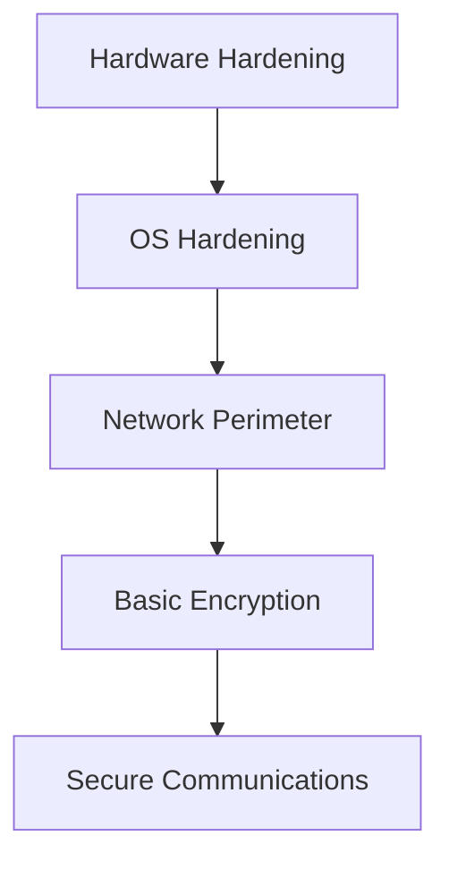

# 🛡️ Guía de Seguridad Digital: Defensa en Profundidad y Zero Trust

## 🧠 Filosofía de Seguridad

La seguridad no es un producto, es un proceso. Cada capa añadida multiplica exponencialmente la resistencia del sistema. Un atacante debe comprometer TODAS las capas para tener éxito. La filosofía Zero Trust se basa en no confiar en nada por defecto y verificar siempre.

### Principios Clave
*   **No confiar por defecto**: Autenticación para cada dispositivo y usuario.
*   **Acceso mínimo necesario**: Limitar permisos por dispositivo.
*   **Segmentación de red**: Separar dispositivos por función.
*   **Monitoreo continuo**: Detectar actividad sospechosa.
*   **Autenticación fuerte**: Verificación constante de identidad.

---

## 🧱 Arquitectura de Seguridad: Modelo de Capas

Una buena arquitectura de seguridad se basa en la defensa en profundidad, donde múltiples capas de seguridad protegen los activos.



### Arquitectura Final Tipo "Dark Army"

```mermaid
graph TD
    subgraph Internet Hostil
        A[Internet]
    end

    subgraph Perímetro
        B[ISP Modem en modo Bridge] --> C{🛡️ pfSense Firewall + IDS/IPS};
    end

    subgraph Red Interna Segmentada
        C --> D[🔀 Managed Switch];
        D --> V10[VLAN 10: Management];
        D --> V20[VLAN 20: Trabajo Confiable];
        D --> V30[VLAN 30: IoT No Confiable];
        D --> V40[VLAN 40: Invitados Aislados];
        D --> V50[VLAN 50: Honeypots & Trampas];
    end
    
    subgraph Endpoints y Servicios
        V10 --> E[🧠 SIEM + Pi-hole];
        V20 --> F[💻 Workstations];
        V50 --> G[🍯 Honeypots];
    end

    subgraph Aislamiento en Workstation
        F --> H[Qubes OS];
        H --> I[VM de Trabajo];
        H --> J[VM de Navegación Anónima - Whonix];
        H --> K[VM de Vault - KeePassXC];
    end

    subgraph Almacenamiento y Recuperación
        L[💾 Backups Offline Cifrados]
    end

    style L fill:#444,stroke:#000,stroke-width:2px
```



---

## 🖥️ Dominio 1: Infraestructura y Sistema Base

### Sistemas Operativos Seguros

| Sistema Operativo | Característica Principal | Uso Ideal | Persistencia | Requiere Instalación |
|---|---|---|---|---|
| **Qubes OS** | Aislamiento total por VM | Seguridad extrema, compartimentalización | Sí | Instalación dedicada |
| **Tails OS** | No guarda datos, todo pasa por Tor | Activismo, periodismo, navegación anónima | Opcional | USB booteable |
| **Whonix** | VM dividida en Gateway (Tor) y Workstation | Anonimato en entorno virtualizado | Sí | VirtualBox / KVM |
| **GrapheneOS** | Android hardened, sin Google tracking | Móvil seguro | Sí | Pixel |
| **CalyxOS** | Android privado con microG | Móvil seguro | Sí | Pixel |
| **PureOS (Live)** | Basado en Debian, enfocado en privacidad | Uso general con enfoque ético | Sí | USB o disco |

### Virtualización y Sandboxing

| Herramienta | Plataforma | Uso Básico | Propósito |
|---|---|---|---|
| **VirtualBox** | Win/Linux/macOS | Crear VMs para aislamiento de tareas, snapshots, red interna. | Laboratorio controlado |
| **KVM / QEMU** | Linux | Virtualización nativa, ideal para servidores y entornos productivos. | Virtualización de alto rendimiento |
| **Firejail** | Linux | `firejail firefox` | Aislar apps por perfil |
| **Flatpak** | Linux | `flatpak run org.mozilla.firefox` | Contenedor seguro |
| **Windows Sandbox**| Windows Pro/Ent | Ejecutar entorno aislado temporal | Pruebas seguras |

### Guía de Instalación y Uso de Herramientas Clave

#### Qubes OS
- **Descarga**: [qubes-os.org/downloads](https://www.qubes-os.org/downloads/)
- **Instalación**: [Guía paso a paso con capturas](https://computingforgeeks.com/install-qubes-os-step-by-step-with-screenshots/)
- **Uso básico**: Aislamiento por qubes (VMs), cada uno con propósito distinto. Ideal para tareas separadas como navegación, pentesting, correo.

#### Tails OS
- **Descarga**: [tails.net/install](https://tails.net/install/)
- **Instalación**: USB booteable con Etcher o Rufus. [Guía oficial](https://tails.net/install/windows/)
- **Uso básico**: Navegación anónima por Tor, no deja rastros en el sistema. Ideal para sesiones temporales.

#### Whonix
- **Descarga**: [whonix.org/wiki/Download](https://www.whonix.org/wiki/Download)
- **Instalación**: Importar Gateway y Workstation en VirtualBox. [Guía detallada](https://www.techiemike.com/a-step-by-step-guide-to-setting-up-whonix-for-enhanced-internet-privacy/)
- **Uso básico**: Todo el tráfico pasa por Tor. Gateway maneja red, Workstation ejecuta apps.

#### GrapheneOS
- **Descarga**: [grapheneos.org/install](https://grapheneos.org/install/)
- **Instalación**: WebUSB installer desde navegador Chromium. Solo para dispositivos Pixel compatibles.
- **Uso básico**: Android hardened, sin Google. Auditor, Vanadium, control granular de permisos.

---

## 🌐 Dominio 2: Perímetro de Red y Conectividad

### Firewall

| Herramienta | Nivel | Uso Básico |
|---|---|---|
| **UFW** | Básico | `sudo ufw default deny incoming` |
| **pfSense** | Avanzado | Firewall completo, NAT, VPN, VLAN, reglas granulares. |
| **OpenWRT** | Avanzado | Router personalizado, SPAN port, VLAN, QoS, firewall extendido. |

### VPN y DNS

| Elemento | Recomendación Máxima Seguridad | Justificación Técnica |
|---|---|---|
| **VPN** | Mullvad / ProtonVPN / VPN propio en VPS | Sin logs, IP dinámica, túnel cifrado |
| **DNS Seguro** | DNSCrypt / DoH con NextDNS o Pi-hole | Evita filtrado ISP y rastreo por DNS |
| **Red WiFi** | WPA3, SSID oculto, MAC filtering | Reduce vectores de ataque locales |

### Guía de Instalación y Uso de Herramientas Clave

#### pfSense
- **Descarga**: [pfsense.org/download](https://www.pfsense.org/download/)
- **Instalación**: USB booteable, interfaz web. [Guía oficial](https://docs.netgate.com/pfsense/en/latest/install/install-walkthrough.html)
- **Uso básico**: Firewall completo, NAT, VPN, VLAN, reglas granulares.

#### OpenWRT
- **Descarga**: [openwrt.org](https://openwrt.org/)
- **Instalación**: Flashear firmware específico del router. [Guía rápida](https://openwrt.org/docs/guide-quick-start/start)
- **Uso básico**: Router personalizado, SPAN port, VLAN, QoS, firewall extendido.

#### Servidor de Red Virtualizado (VPN + Pi-hole)
- **Concepto**: En lugar de usar hardware dedicado como una Raspberry Pi, se puede lograr el mismo resultado con una máquina virtual (VM) ligera en un PC que esté siempre encendido. Esto proporciona un servidor de red aislado para filtrar DNS y gestionar tu propia VPN sin coste de hardware adicional.
- **1. Crear la VM**: Usa VirtualBox o KVM para crear una VM con un sistema operativo ligero como **Debian Server** o **Ubuntu Server** (instalación mínima). Asigna recursos modestos (1-2 CPU, 1-2 GB RAM, 20 GB de disco).
- **2. Configurar la Red**: **CRÍTICO:** Configura el adaptador de red de la VM en modo **Puente (Bridged Adapter)**. Esto le dará a la VM su propia IP en tu red local, como si fuera un dispositivo físico. Asígnale una IP estática dentro de la VM.
- **3. Instalar Software (dentro de la VM)**:
    - **Pi-hole Setup**: Sigue la guía oficial en [pi-hole.net](https://pi-hole.net/).
    - **VPN Setup**: Instala un servidor VPN. El script de [PiVPN para WireGuard](https://www.youtube.com/watch?v=DUpIOSbbvKk) funciona perfectamente en Debian/Ubuntu.
- **Uso básico**: El resultado es el mismo: una red local filtrada, DNS seguro y un nodo VPN propio, todo corriendo de forma aislada en una VM.

---

## 🔐 Dominio 3: Criptografía y Gestión de Datos

### Cifrado de Archivos y Discos

| Herramienta | Sistema Compatible | Uso Básico | Nivel de Seguridad |
|---|---|---|---|
| **BitLocker** | Windows Pro/Ent | Activar → Elegir PIN → Guardar clave de recuperación | Alto |
| **LUKS (dm-crypt)**| Linux | Cifrado completo con passphrase en arranque | Muy alto |
| **VeraCrypt** | Win/Linux/macOS | Crear volumen → Montar → Usar como disco normal | Alto |
| **GPG** | Win/Linux/macOS | `gpg --encrypt --recipient user file.txt` | Alto (manual) |

### Gestores de Contraseñas y Autenticación

| Elemento | Recomendación Máxima Seguridad | Justificación Técnica |
|---|---|---|
| **Autenticación** | 2FA físico (YubiKey), SSH Keys, contraseñas únicas | Evita phishing, acceso no autorizado |
| **Gestor de Contraseñas** | KeePassXC / Bitwarden (self-hosted) | Vault cifrado, sin dependencia de terceros |

### Transferencia de Archivos

| Herramienta | Propósito Principal | Uso Básico | Nivel de Anonimato |
|---|---|---|---|
| **Magic Wormhole** | Transferencia segura de archivos | `wormhole send file.txt` → `wormhole receive code` | Alto (peer-to-peer) |
| **OnionShare** | Compartir archivos y chat anónimos | Arrastrar archivo → Generar link `.onion` | Muy alto |
| **Syncthing** | Sincronización privada de archivos | Añadir carpeta → Compartir con otro dispositivo | Medio–Alto |

---

## 🕵️ Dominio 4: Navegación y Anonimato

### Navegadores y Extensiones

| Elemento | Recomendación Máxima Seguridad | Justificación Técnica |
|---|---|---|
| **Navegador Web** | Tor Browser / Firefox Hardened | Tor para anonimato, Firefox con configuración estricta |
| **Extensiones clave** | uBlock Origin, NoScript, HTTPS Everywhere | Bloqueo de scripts, rastreadores y conexiones inseguras |

### Evasión de Fingerprinting

| Técnica | Descripción | Herramientas / Acciones Recomendadas |
|---|---|---|
| **Uniformidad de huella** | Usar configuraciones genéricas para parecerse a muchos usuarios | Tor Browser (todos los usuarios comparten fingerprint) |
| **Spoofing activo** | Alterar manualmente User-Agent, WebGL, Canvas, etc. | `CanvasBlocker`, `User-Agent Switcher`, `Trace`, `Chameleon` |
| **Bloqueo de scripts** | Evitar que scripts recopilen datos del navegador | `NoScript`, `uBlock Origin`, `Privacy Badger` |
| **Navegadores modificados** | Usar navegadores diseñados para evadir fingerprinting | Brave (con fingerprint randomization), LibreWolf |

---

## 💬 Dominio 5: Comunicaciones Seguras

### Mensajería y Correo

| Herramienta | Propósito Principal | Nivel de Anonimato | Requiere Tor |
|---|---|---|---|
| **Signal** | Mensajería cifrada | Alto (metadatos mínimos) | No |
| **Session** | Mensajería anónima sin número | Muy alto | Sí (usa red onion propia) |
| **Element (Matrix)** | Mensajería descentralizada | Medio–Alto | Opcional |
| **ProtonMail** | Correo electrónico cifrado | Alto | No |
| **Tutanota** | Correo electrónico cifrado | Alto | No |

---

## 🛡️ Dominio 6: Detección, Respuesta y Defensa Activa

### Detección de Intrusos

| Herramienta | Tipo | Uso Básico | Nivel de Visibilidad |
|---|---|---|---|
| **OSSEC** | HIDS (Linux/Win) | Monitorea logs, integridad, alertas por correo | Alta |
| **CrowdSec** | HIDS + Remediación | Detecta ataques → Bouncer bloquea IPs | Muy alta |
| **Auditd** | Linux | Monitorea syscalls, accesos, cambios críticos | Alta |
| **Fail2Ban** | Linux | Detecta brute force → bloquea IPs | Media |

### Técnicas Avanzadas de Protección

| Técnica | Descripción | Herramienta Recomendada |
|---|---|---|
| **Honeytokens** | Archivos falsos para detectar acceso no autorizado | Crear `.docx` con alerta → monitorear acceso |
| **Canary Files** | Archivos trampa con alertas automáticas | OSSEC / Auditd / scripts personalizados |
| **Steganografía** | Ocultar datos dentro de imágenes o audio | `steghide`, `zsteg`, `outguess` |
| **Red Team Local** | Simular ataques para probar defensas | `Metasploit`, `Caldera`, `Atomic Red Team` |
| **Control de Integridad**| Detectar cambios en archivos clave | `AIDE`, `Tripwire`, `OSSEC` |

---

## 🧰 Anexo: Herramientas y Scripts

### Scripts Útiles

#### Crear volumen Veracrypt desde CLI
```bash
veracrypt --text --create /home/user/secure.hc \
  --size 500M --encryption AES --hash SHA-512 \
  --filesystem ext4 --password "TuClaveSegura"
```

#### Ejecutar Firefox en Firejail
```bash
firejail --private firefox
```

#### Ver alertas OSSEC
```bash
sudo tail -f /var/ossec/logs/alerts/alerts.log
```

#### Activar CrowdSec y ver IPs bloqueadas
```bash
sudo systemctl start crowdsec
sudo cscli decisions list
```

#### Crear red segmentada en OpenWRT
```bash
uci set network.iot=interface
uci set network.iot.proto='static'
uci set network.iot.ipaddr='192.168.50.1'
uci set network.iot.netmask='255.255.255.0'
uci commit network
/etc/init.d/network restart
```

#### Activar DNSCrypt en Linux
```bash
sudo apt install dnscrypt-proxy
sudo systemctl enable dnscrypt-proxy
sudo systemctl start dnscrypt-proxy
```

#### Fingerprint Evasion en Firefox (about:config)
```
privacy.resistFingerprinting → true
webgl.disabled → true
canvas.poisondata → true
```

### Protocolos de Emergencia

#### Incident Response Playbook
```bash
#!/bin/bash
# Emergency incident response script

# 1. Network isolation
sudo iptables -P INPUT DROP
sudo iptables -P FORWARD DROP  
sudo iptables -P OUTPUT DROP
sudo iptables -A OUTPUT -p udp --dport 53 -j ACCEPT  # DNS only

# 2. Memory dump
sudo apt install volatility3
sudo dd if=/dev/mem of=/tmp/memory_dump.raw bs=1M

# 3. Disk imaging
sudo dd if=/dev/sda of=/external/disk_image.dd bs=4096 conv=noerror,sync

# 4. Log preservation
sudo tar -czf /external/logs_$(date +%Y%m%d_%H%M%S).tar.gz /var/log/

# 5. Process analysis
ps auxww > /external/processes.txt
netstat -tulnp > /external/network_connections.txt
lsof > /external/open_files.txt

# 6. Alert external monitoring
curl -X POST https://monitoring.domain.com/alert \
  -d "host=$(hostname)&incident=true&timestamp=$(date -Iseconds)"
```

#### Compromise Recovery
```bash
#!/bin/bash
# Automated compromise recovery

# 1. Kill suspicious processes
pkill -f "suspicious_binary"
pkill -f "known_malware"

# 2. Remove persistence mechanisms
crontab -l | grep -v "malicious_cron" | crontab -
find /etc/systemd/system/ -name "*.service" -exec grep -l "suspicious" {} \; | xargs rm

# 3. Reset credentials
passwd root
passwd $USER

# 4. Update and harden system
apt update && apt upgrade -y
apt autoremove --purge

# 5. Restore from clean backup
rsync -av /backup/clean_system/ / --exclude=/proc --exclude=/sys
```