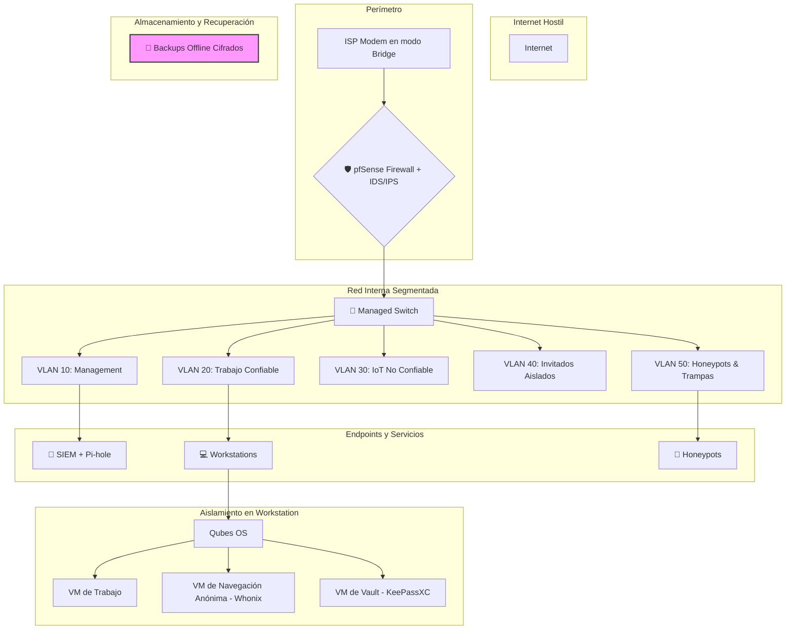

# 🛡️ Guía Definitiva de Seguridad Digital: Arquitectura de Defensa en Profundidad
## *"Capa por Capa, Sin Regalar Oportunidades"*

> **Filosofía**: La seguridad no es un producto, es un proceso. Cada capa añadida multiplica la resistencia del sistema. Esta guía está diseñada para ser un manual completo, desde los principios fundamentales hasta la implementación de una fortaleza digital de nivel experto.

---

## **PARTE 0: LA MENTALIDAD Y LOS PRINCIPIOS (ZERO TRUST)**

### **Filosofía KISS: "Nunca confíes, siempre verifica"**
Zero Trust no es complicado. Es simplemente **NO CONFIAR EN NADA** hasta que demuestre que es legítimo. Antes de sumergirte en la técnica, interioriza el concepto.

| 🎥 **Videos Esenciales** | Duración | Propósito |
|--------------------------|----------|-----------|
| [What is Zero Trust? - IBM](https://www.youtube.com/watch?v=CFNy9jN3iCQ) | 5 min | Concepto básico |
| [Zero Trust Architecture Explained](https://www.youtube.com/watch?v=1cozDbMjNoc) | 8 min | Implementación práctica |
| [Home Network Security](https://www.youtube.com/watch?v=YEzLVdH4n-M) | 15 min | Aplicación doméstica |

### **Matriz Zero Trust Simplificada**

| Principio | En Casa Normal | Zero Trust Casa | Herramienta | Tiempo Setup |
|-----------|----------------|-----------------|-------------|--------------|
| **Identidad** | Contraseña de router `admin/admin` | Cada dispositivo autenticado | YubiKey + pfSense | 30 min |
| **Dispositivos** | Todos en la misma red | Segmentación por VLANs | Managed Switch | 45 min |
| **Aplicaciones** | Acceso libre | Whitelisting + firewall de app | UFW + AppArmor | 20 min |
| **Datos** | Sin cifrar | Todo cifrado en reposo y tránsito | LUKS + VeraCrypt | 40 min |
| **Red** | Confianza total en la LAN | Monitoreo total y segmentación | Pi-hole + Suricata | 60 min |

---

## **PARTE 1: EL BLUEPRINT (ARQUITECTURA DE DEFENSA)**

### **Arquitectura Final Tipo "Dark Army"**
**🎯 CONTEXTO**: Al completar esta guía, tu setup doméstico rivaliza con infraestructuras de nivel estatal. Cada componente cumple un rol específico en la defensa en profundidad. Si un atacante compromete una capa, las otras siguen protegiéndote.



### **Matriz de Dominios de Seguridad**
Esta matriz sirve como referencia rápida para todas las herramientas y técnicas cubiertas, clasificadas por dominio y nivel de habilidad.

#### 🖥️ **INFRAESTRUCTURA BASE**
| Componente | Básico | Intermedio | Avanzado | Experto |
|------------|---------|------------|----------|---------|
| **Sistema Operativo** | Ubuntu LTS + hardening | Qubes OS | Whonix Gateway+Workstation | Custom hardened kernel |
| **Virtualización** | VirtualBox | KVM/QEMU | Xen hypervisor | Type-1 hypervisor dedicado |
| **Hardware Security** | TPM activado | Hardware tokens (YubiKey) | Libreboot/Coreboot | Air-gapped systems |
| **Bootloader** | GRUB con password | Secure Boot + keys | coreboot + heads | Custom UEFI payload |
| **Firmware** | UEFI defaults | Custom UEFI settings | ME_cleaner aplicado | Completely libre firmware |

#### 🌐 **PERÍMETRO DE RED Y CONECTIVIDAD**
| Componente | Básico | Intermedio | Avanzado | Experto |
|------------|---------|------------|----------|---------|
| **Firewall** | UFW básico | pfSense/OPNsense | Distributed firewalling | Custom iptables + eBPF |
| **IDS/IPS** | Fail2ban | Suricata | Wazuh + ELK Stack | Custom ML-based detection |
| **VPN** | Commercial VPN | WireGuard server propio | Multi-hop VPN chain | Tor + VPN + I2P tunnel |
| **DNS** | Quad9/Cloudflare | Pi-hole + DoH | Unbound recursive | Custom authoritative server |
| **Network Segmentation** | Guest WiFi | VLANs configuradas | Micro-segmentation | Zero-trust networking |

#### 🔐 **CRIPTOGRAFÍA Y GESTIÓN DE IDENTIDAD**
| Componente | Básico | Intermedio | Avanzado | Experto |
|------------|---------|------------|----------|---------|
| **Disk Encryption** | LUKS/BitLocker | VeraCrypt (Hidden Vol) | Randomized keys + TPM | Hardware encryption + HSM |
| **Password Management**| Bitwarden cloud | KeePassXC local | Pass + GPG | Hardware security keys |
| **PKI Management** | Basic GPG keys | Certificate authority | Hardware tokens | Distributed PKI |
| **Multi-Factor Auth** | TOTP apps | Hardware FIDO2 (YubiKey) | Smart cards | Biometric + hardware |
| **Key Management** | Local storage | Encrypted storage | HSM integration | Distributed key sharding |

#### 🕵️ **NAVEGACIÓN Y ANONIMATO**
| Componente | Básico | Intermedio | Avanzado | Experto |
|------------|---------|------------|----------|---------|
| **Browser** | Firefox hardened | Tor Browser | LibreWolf + Arkenfox | Custom compiled browser |
| **Fingerprint Resistance** | Basic spoofing | Canvas poisoning | VM por sesión (Qubes) | Hardware randomization |
| **Traffic Analysis Resistance** | VPN only | Tor + VPN | Traffic padding | Decoy traffic generation |

#### 💬 **COMUNICACIONES SEGURAS**
| Componente | Básico | Intermedio | Avanzado | Experto |
|------------|---------|------------|----------|---------|
| **Messaging** | Signal | Session / Element | Briar / Ricochet Refresh | Custom protocols + TAILS |
| **Email** | ProtonMail / Tutanota | Thunderbird + GPG | Anonymouse remailers | Mix networks |
| **File Transfer** | OnionShare | Magic Wormhole | Syncthing + Tor | Custom P2P + steganography |
| **Metadata Scrubbing** | Manual cleaning | ExifTool automation | MAT2 + PDF sanitization | Custom parsers + TAILS amnesia |

#### 🛡️ **DETECCIÓN Y RESPUESTA (DEFENSA ACTIVA)**
| Componente | Básico | Intermedio | Avanzado | Experto |
|------------|---------|------------|----------|---------|
| **Host Monitoring** | Basic logging | OSSEC HIDS | Wazuh + ELK | Custom EDR solution |
| **Network Monitoring**| Router logs | Ntopng / Zeek | Security Onion | Custom SIEM |
| **Threat Intelligence**| Public feeds | MISP integration | Custom IOCs | Threat hunting |
| **Incident Response** | Manual analysis | Automated playbooks | SOAR platform | Custom IR framework |

#### 🧬 **TÉCNICAS OFENSIVAS PARA DEFENSA (RED TEAM LOCAL)**
| Componente | Básico | Intermedio | Avanzado | Experto |
|------------|---------|------------|----------|---------|
| **Vulnerability Assessment** | OpenVAS | Nessus + Nmap | Custom scanners | Zero-day research |
| **Penetration Testing** | Basic Metasploit | Cobalt Strike | Custom C2 frameworks | APT simulation (Caldera) |
| **Physical Security** | Basic OSINT | Lock picking + RFID | Hardware implants | Supply chain attacks |

---

## **PARTE 2: GUÍA DE IMPLEMENTACIÓN SECUENCIAL**

### **FASE I: FUNDAMENTOS INEXPUGNABLES (Semana 1-2)**
Aquí se construye la base. Si esta fase falla, todo lo demás es inútil.

#### **1. Hardening del Sistema Operativo Base (Ubuntu/Debian)**
**🎯 CONTEXTO**: Un sistema operativo por defecto es una puerta abierta. Este script lo convierte en una fortaleza inicial.

```bash
#!/bin/bash
# EJECUTAR EN: Terminal de tu sistema recién instalado.
# PROPÓSITO: Aplicar configuraciones de seguridad críticas.

echo "🛡️ INICIANDO HARDENING DEL SISTEMA BASE..."

# Kernel hardening (protección contra exploits de memoria y red)
sudo cat >> /etc/sysctl.d/99-security.conf << EOF
kernel.dmesg_restrict = 1
kernel.kptr_restrict = 2
kernel.yama.ptrace_scope = 3
net.ipv4.tcp_syncookies = 1
net.ipv4.conf.all.rp_filter = 1
net.ipv4.conf.all.accept_source_route = 0
EOF
sudo sysctl -p

# Mandatory Access Control (sandboxing de aplicaciones)
sudo apt update && sudo apt install apparmor apparmor-utils -y
sudo aa-enforce /etc/apparmor.d/*

# Auditoría del sistema (registrar acciones críticas)
sudo apt install auditd -y
sudo auditctl -w /etc/passwd -p wa -k user_modification
sudo auditctl -w /etc/sudoers -p wa -k privilege_escalation
sudo systemctl enable auditd && sudo systemctl start auditd

# Firewall de host (control de tráfico básico)
sudo apt install ufw -y
sudo ufw default deny incoming
sudo ufw default allow outgoing
sudo ufw allow ssh # ¡IMPORTANTE SI ES REMOTO!
sudo ufw enable

# Protección contra fuerza bruta
sudo apt install fail2ban -y
sudo systemctl enable fail2ban && sudo systemctl start fail2ban

echo "✅ HARDENING BÁSICO COMPLETADO."
```

#### **2. Perímetro de Red Defensivo (pfSense)**
**🎯 CONTEXTO**: Tu router de ISP no es un firewall. pfSense convierte una PC vieja en un cortafuegos de nivel empresarial con IDS/IPS.

```bash
# QUÉ ES: Firewall/router open source basado en FreeBSD.
# DÓNDE: PC dedicada con 2+ tarjetas de red (NICs) o VM.
# PROPÓSITO: Control total del tráfico, bloqueo geográfico, detección de intrusiones.

# 1. Descargar pfSense desde https://pfsense.org/download/
# 2. Instalar en hardware dedicado.
# 3. Acceder a la interfaz web (usualmente https://192.168.1.1).

# CONFIGURACIÓN CRÍTICA POST-INSTALACIÓN:
# -> System > Advanced > Admin Access: Cambiar puerto y habilitar HTTPS.
# -> Interfaces: Asignar WAN (del ISP) y LAN (a tu switch).
# -> Firewall > Rules > WAN: Bloquear redes privadas (RFC1918) y bogons.

# INSTALAR PAQUETES (System > Package Manager):
# - pfBlockerNG: Para bloqueo de IPs maliciosas, trackers y países.
# - Suricata: Para IDS/IPS (detección y bloqueo de ataques en tiempo real).
# - ntopng: Para visualización y análisis de tráfico.

# CONFIGURACIÓN DE PAQUETES:
# - pfBlockerNG: Habilitar listas DNSBL (EasyList, MalwareDomainList) y GeoIP (bloquear países de alto riesgo).
# - Suricata: Habilitar en interfaz WAN y LAN, usar reglas de "Emerging Threats" y ponerlo en modo "Block Offenders".
```

#### **3. DNS Seguro (Pi-hole + DoH)**
**🎯 CONTEXTO**: Tu ISP registra todos los sitios que visitas. Esta configuración cifra tus peticiones DNS y bloquea malware y publicidad para toda tu red.

```bash
# QUÉ ES: Servidor DNS local para bloqueo de dominios + túnel cifrado.
# DÓNDE: Raspberry Pi o una VM dedicada en tu red.
# PROPÓSITO: Privacidad frente al ISP y protección contra malware para todos los dispositivos.

# Instalación de Pi-hole
curl -sSL https://install.pi-hole.net | bash

# Instalación de Cloudflared para DNS-over-HTTPS (DoH)
wget https://github.com/cloudflare/cloudflared/releases/latest/download/cloudflared-linux-amd64.deb
sudo dpkg -i cloudflared-linux-amd64.deb
sudo cloudflared service install

# Configurar Pi-hole para usar el túnel DoH
# En la interfaz web de Pi-hole > Settings > DNS:
# - Desmarcar todos los proveedores de DNS.
# - En "Custom 1 (IPv4)", poner: 127.0.0.1#5053
# - Guardar cambios.

# Configurar tu router principal (DHCP) para que use la IP de tu Pi-hole como servidor DNS.
```

### **FASE II: CRIPTOGRAFÍA Y GESTIÓN DE IDENTIDAD (Semana 3-4)**
Aquí protegemos los datos en reposo y aseguramos que solo tú seas tú.

#### **1. Cifrado de Disco Completo y Volúmenes Ocultos**
**🎯 CONTEXTO**: Si te roban el equipo, el cifrado es tu única defensa. LUKS protege el sistema, VeraCrypt crea compartimentos secretos con negación plausible.

```bash
# Cifrado de sistema completo con LUKS (Durante la instalación de Linux)
# - Elegir la opción "Use LVM with encryption" o configurar manualmente.

# Crear un volumen oculto con VeraCrypt para negación plausible
# INSTALACIÓN: sudo apt install veracrypt
veracrypt --text --create /path/to/outer_volume.hc \
  --size 10G --encryption AES --hash SHA-512 \
  --password "OuterPassword_PocoSecreta" \
  --hidden-volume --hidden-password "HiddenPassword_UltraSecreta" \
  --hidden-size 1G

# MONTAJE: Montas el volumen con la contraseña externa. Los datos "cebo" se guardan ahí.
# Si te fuerzan a revelar la contraseña, das la externa. La existencia del volumen
# oculto es matemáticamente indemostrable. Para acceder al oculto, montas el mismo
# archivo pero con la contraseña oculta.
```

#### **2. Gestión de Identidad con Llaves Físicas (YubiKey)**
**🎯 CONTEXTO**: Las contraseñas se filtran. Una llave física no. Esto hace que el phishing y el robo de credenciales sea prácticamente imposible.

```bash
# QUÉ ES: Token de hardware para 2FA, GPG y claves SSH.
# PROPÓSITO: Autenticación "algo que tienes", no solo "algo que sabes".

# INSTALACIÓN: sudo apt install yubikey-manager libpam-u2f
ykman info # Verificar que la llave es reconocida

# CONFIGURAR GPG CON LA YUBIKEY (la clave privada nunca abandona el hardware)
gpg --card-edit
> admin
> generate # Sigue las instrucciones para generar las claves DENTRO de la llave.

# CONFIGURAR POLÍTICA DE TOQUE (requiere toque físico para cada operación)
ykman openpgp keys set-touch sig on
ykman openpgp keys set-touch enc on
ykman openpgp keys set-touch aut on

# USAR YUBIKEY PARA SSH (máxima seguridad para acceso a servidores)
gpg --export-ssh-key TU_GPG_KEY_ID > ~/.ssh/yubikey_id.pub
# Añade el contenido de yubikey_id.pub al authorized_keys del servidor.
```

### **FASE III: ANONIMATO Y COMUNICACIONES SEGURAS (Semana 5-6)**
Aquí nos centramos en proteger la identidad durante la navegación y las conversaciones.

#### **1. Navegación Anónima y Aislada**
**🎯 CONTEXTO**: Para investigación sensible, periodismo o activismo, es crucial no dejar rastro y no vincular la actividad a tu identidad real.

*   **Tails OS**:
    *   **Uso**: Para sesiones críticas y temporales.
    *   **Cómo**: Se bootea desde un USB. Todo el tráfico pasa por Tor. No deja rastro en el disco duro del PC. Es *amnésico*.
    *   **Instalación**: Sigue la guía en `tails.net/install`.

*   **Whonix (Dentro de Qubes OS o VirtualBox)**:
    *   **Uso**: Para un entorno de trabajo anónimo persistente.
    *   **Cómo**: Consta de dos VMs. Una `Gateway` que fuerza todo el tráfico a través de Tor, y una `Workstation` donde trabajas. Es imposible que una aplicación en la Workstation se conecte a internet sin pasar por Tor.
    *   **Instalación**: Importar las plantillas desde `whonix.org`.

#### **2. Comunicaciones Cifradas y Anónimas**
**🎯 CONTEXTO**: Las llamadas y mensajes son objetivos principales de vigilancia. Usa aplicaciones con cifrado de extremo a extremo (E2EE) auditado.

*   **Signal (Privacidad)**:
    *   **Uso**: Reemplazo seguro de WhatsApp/Telegram.
    *   **Seguridad**: E2EE por defecto, metadatos mínimos. Requiere número de teléfono.
    *   **Configuración clave**: `Settings > Privacy > Relay Calls` (oculta tu IP en llamadas).

*   **Session (Anonimato)**:
    *   **Uso**: Cuando ni siquiera los metadatos son aceptables.
    *   **Seguridad**: No requiere número de teléfono. Usa su propia red tipo onion para ocultar la IP y la identidad.
    *   **OPSEC**: No vincules tu Session ID a tu identidad real. Compártelo por un canal seguro.

#### **3. Transferencia Segura de Archivos**
**🎯 CONTEXTO**: Enviar archivos por email o servicios en la nube es inseguro. Estas herramientas crean túneles P2P cifrados.

*   **OnionShare**:
    *   **Uso**: Compartir archivos de forma anónima a través de la red Tor.
    *   **Cómo**: Genera una dirección `.onion` única y temporal para que la otra persona descargue el archivo.

*   **Magic Wormhole**:
    *   **Uso**: Enviar archivos directamente de un terminal a otro de forma rápida y segura.
    *   **Cómo**: `wormhole send miarchivo.zip` genera un código. La otra persona escribe `wormhole receive CODIGO` y la transferencia P2P comienza.

### **FASE IV: DEFENSA ACTIVA Y RESPUESTA (Semana 7-8)**
Aquí pasamos de la defensa pasiva a la detección activa y la preparación para lo peor.

#### **1. Detección de Intrusos en Host y Red (HIDS/NIDS)**
**🎯 CONTEXTO**: No puedes defenderte de lo que no ves. Estas herramientas son tus ojos y oídos en el sistema y la red.

```bash
# HIDS (Host-based) con Wazuh/OSSEC
# QUÉ ES: Un agente que monitoriza la integridad de archivos, logs y actividad del sistema.
# INSTALACIÓN: Sigue la guía oficial para instalar el agente y conectarlo a un servidor.
# ALERTA TÍPICA: "File /etc/passwd changed" -> posible creación de usuario no autorizado.

# NIDS (Network-based) con Zeek
# QUÉ ES: Un sensor que analiza el tráfico de red en busca de patrones sospechosos.
# INSTALACIÓN: sudo apt install zeek && sudo zeekctl deploy
# ALERTA TÍPICA: "SSH brute-forcing detected from IP 1.2.3.4"
```

#### **2. Honeypots y Canary Tokens**
**🎯 CONTEXTO**: Engaña a los atacantes con trampas. Si alguien interactúa con un honeypot, sabes con un 100% de certeza que es actividad maliciosa.

```bash
# Honeypot de SSH con Cowrie
# QUÉ ES: Un servidor SSH falso que simula un sistema vulnerable y registra todos los comandos del atacante.
git clone https://github.com/cowrie/cowrie.git
# Sigue la guía de instalación. Colócalo en una VLAN aislada.

# Canary Tokens
# QUÉ ES: Archivos o URLs trampa. Si alguien abre el archivo o visita la URL, recibes una alerta instantánea.
# CÓMO: Créalos gratis en canarytokens.org. Coloca un "passwords.docx" falso en tu escritorio.
# Si recibes una alerta, tu máquina está comprometida.
```

#### **3. Protocolos de Emergencia y Respuesta a Incidentes**
**🎯 CONTEXTO**: Cuando todo falle, necesitas un plan. Este script es tu botón de pánico.

```bash
#!/bin/bash
# SCRIPT DE RESPUESTA A INCIDENTES - NO EJECUTAR A MENOS QUE SEA REAL

echo "🔴 AISLAMIENTO DE RED INICIADO..."
sudo iptables -P INPUT DROP
sudo iptables -P FORWARD DROP
sudo iptables -P OUTPUT DROP
sudo iptables -A OUTPUT -o lo -j ACCEPT # Permitir comunicación local

echo "💾 DUMP DE MEMORIA EN PROCESO..."
sudo apt install lime-forensics-dkms -y
sudo lime -o /mnt/external_drive/memory_dump.lime -f lime

echo "📑 PRESERVACIÓN DE EVIDENCIA CLAVE..."
sudo zip /mnt/external_drive/logs_$(hostname)_$(date +%F).zip /var/log/*
ps auxww > /mnt/external_drive/processes.txt
netstat -anop > /mnt/external_drive/netstat.txt

echo "🚨 ALERTA ENVIADA. EL SISTEMA ESTÁ AISLADO. INICIAR ANÁLISIS FORENSE."
```

---

## **PARTE 3: VALIDACIÓN Y TÉCNICAS AVANZADAS**

### **Pentesting Interno Automatizado**
**🎯 CONTEXTO**: La única forma de saber si tus defensas funcionan es atacándolas tú mismo.

```bash
#!/bin/bash
# SCRIPT SEMANAL DE AUTO-EVALUACIÓN DE SEGURIDAD

REPORT_FILE="/var/log/security_report_$(date +%F).txt"
echo "## INFORME DE SEGURIDAD SEMANAL ##" > $REPORT_FILE

echo "--- Escaneo de Red Local ---" >> $REPORT_FILE
sudo nmap -sS -A 192.168.1.0/24 >> $REPORT_FILE

echo "--- Escaneo de Vulnerabilidades Web Local ---" >> $REPORT_FILE
nikto -h http://localhost >> $REPORT_FILE

echo "--- Verificación de Configuración de Hardening ---" >> $REPORT_FILE
# Comprueba si ufw está activo
ufw status | grep "Status: active" || echo "ALERTA: UFW INACTIVO" >> $REPORT_FILE
# Comprueba si hay actualizaciones de seguridad pendientes
apt list --upgradable 2>/dev/null | grep -i "security" >> $REPORT_FILE

echo "## INFORME GENERADO EN $REPORT_FILE ##"
```

### **Próximas Fronteras**

*   **AI/ML Security**: Utilizar modelos de Machine Learning para detectar anomalías en el tráfico de red o en el comportamiento del sistema que las reglas tradicionales no captarían.
*   **Quantum-Resistant Cryptography (PQC)**: Empezar a experimentar con algoritmos como Kyber (KEM) y Dilithium (firmas) en entornos no críticos, preparándose para la era de la computación cuántica.
*   **Zero-Trust a Nivel de Aplicación**: Usar herramientas como Cilium en Kubernetes o AppArmor en modo estricto para crear políticas donde las aplicaciones solo pueden comunicarse con lo estrictamente necesario, aplicando el principio de "nunca confíes, siempre verifica" a nivel de proceso.