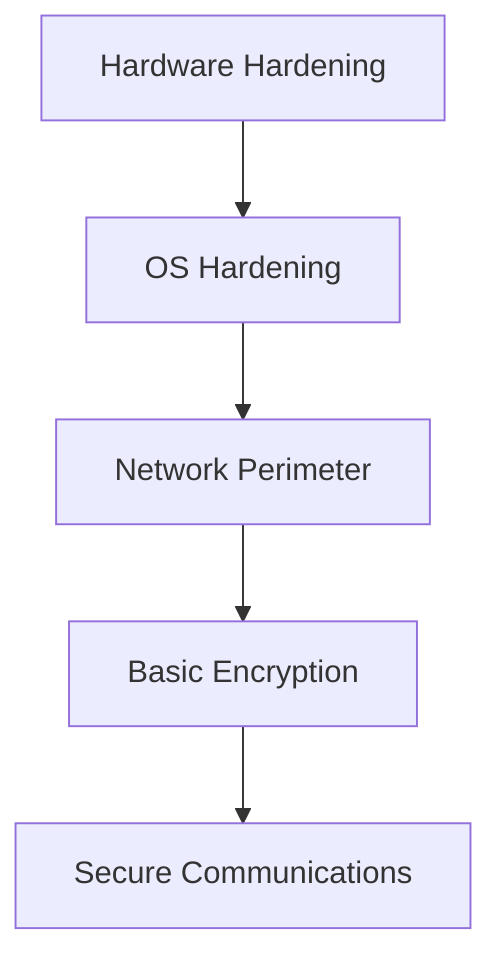

# 🛡️ Guía Definitiva de Seguridad Digital: Defensa en Profundidad y Zero Trust

## 🧠 Filosofía de Seguridad

La seguridad no es un producto, es un proceso. Cada capa añadida multiplica exponencialmente la resistencia del sistema. Un atacante debe comprometer TODAS las capas para tener éxito. La filosofía Zero Trust se basa en no confiar en nada por defecto y verificar siempre.

### Principios Clave
*   **No confiar por defecto**: Autenticación para cada dispositivo y usuario.
*   **Acceso mínimo necesario**: Limitar permisos por dispositivo.
*   **Segmentación de red**: Separar dispositivos por función.
*   **Monitoreo continuo**: Detectar actividad sospechosa.
*   **Autenticación fuerte**: Verificación constante de identidad.

---

## 🧱 Arquitectura de Seguridad: Modelo de Capas

Una buena arquitectura de seguridad se basa en la defensa en profundidad, donde múltiples capas de seguridad protegen los activos.



### Arquitectura Final Tipo "Dark Army"

```
INTERNET HOSTIL
      ↓
┌─────────────────────────────────────┐
│  🌐 ISP MODEM (No tocar - ISP)      │  
└─────────────────┬───────────────────┘
                  ↓
┌─────────────────────────────────────┐
│  🛡️ pfSense FIREWALL + IDS/IPS      │ ← Hardware dedicado
│  • Geo-blocking (bloquea países)    │   (PC vieja con 2 NICs)
│  • DPI + Suricata rules             │
│  • pfBlockerNG threat intel         │
└─────────────────┬───────────────────┘
                  ↓
┌─────────────────────────────────────┐
│  🔀 MANAGED SWITCH + VLANs          │
│  ├─ VLAN 10: Management            │
│  ├─ VLAN 20: Workstations          │  
│  ├─ VLAN 30: IoT Devices           │
│  ├─ VLAN 40: Guests                │
│  └─ VLAN 50: Honeypots             │
└─────┬─────┬─────┬─────┬─────────────┘
      ↓     ↓     ↓     ↓     
  [MGT]  [WORK] [IoT] [HONEY]
      ↓     ↓           ↓
┌──────┐ ┌─────────────────┐ ┌──────────┐
│ SIEM │ │ 💻 WORKSTATION  │ │ 🍯 TRAPS │
│ +ELK │ │ ┌─────────────┐ │ │ Cowrie   │
│ +Pi  │ │ │ Qubes OS    │ │ │ Canary   │
│ hole │ │ │ ├─ work-vm  │ │ │ OpenC.   │
└──────┘ │ │ ├─ anon-vm  │ │ └──────────┘
         │ │ ├─ vault-vm │ │
         │ │ └─ untrst   │ │
         │ └─────────────┘ │
         │ ┌─────────────┐ │
         │ │ Whonix      │ │ ← Para tareas anónimas
         │ │ Gateway+WS  │ │   TODO por Tor
         │ └─────────────┘ │
         │ ┌─────────────┐ │  
         │ │ TAILS USB   │ │ ← Boot cuando necesites
         │ │ (amnésico)  │ │   sesión sin rastros
         │ └─────────────┘ │
         └─────────────────┘

      ALMACENAMIENTO OFFLINE
         ┌─────────────┐
         │ 💾 Backups  │ ← Air-gapped, cifrados
         │ + Claves    │   Nunca conectados
         │ + Recovery  │   a internet
         └─────────────┘
```

---

## 🖥️ Dominio 1: Infraestructura y Sistema Base

### Sistemas Operativos Seguros

| Sistema Operativo | Característica Principal | Uso Ideal | Persistencia | Requiere Instalación |
|---|---|---|---|---|
| **Qubes OS** | Aislamiento total por VM | Seguridad extrema, compartimentalización | Sí | Instalación dedicada |
| **Tails OS** | No guarda datos, todo pasa por Tor | Activismo, periodismo, navegación anónima | Opcional | USB booteable |
| **Whonix** | VM dividida en Gateway (Tor) y Workstation | Anonimato en entorno virtualizado | Sí | VirtualBox / KVM |
| **GrapheneOS** | Android hardened, sin Google tracking | Móvil seguro | Sí | Pixel |
| **CalyxOS** | Android privado con microG | Móvil seguro | Sí | Pixel |
| **PureOS (Live)** | Basado en Debian, enfocado en privacidad | Uso general con enfoque ético | Sí | USB o disco |

### Virtualización y Sandboxing

| Herramienta | Plataforma | Uso Básico | Propósito |
|---|---|---|---|
| **VirtualBox** | Win/Linux/macOS | Crear VMs para aislamiento de tareas, snapshots, red interna. | Laboratorio controlado |
| **KVM / QEMU** | Linux | Virtualización nativa, ideal para servidores y entornos productivos. | Virtualización de alto rendimiento |
| **Firejail** | Linux | `firejail firefox` | Aislar apps por perfil |
| **Flatpak** | Linux | `flatpak run org.mozilla.firefox` | Contenedor seguro |
| **Windows Sandbox**| Windows Pro/Ent | Ejecutar entorno aislado temporal | Pruebas seguras |

---

## 🌐 Dominio 2: Perímetro de Red y Conectividad

### Firewall

| Herramienta | Nivel | Uso Básico |
|---|---|---|
| **UFW** | Básico | `sudo ufw default deny incoming` |
| **pfSense** | Avanzado | Firewall completo, NAT, VPN, VLAN, reglas granulares. |
| **OpenWRT** | Avanzado | Router personalizado, SPAN port, VLAN, QoS, firewall extendido. |

### VPN y DNS

| Elemento | Recomendación Máxima Seguridad | Justificación Técnica |
|---|---|---|
| **VPN** | Mullvad / ProtonVPN / VPN propio en VPS | Sin logs, IP dinámica, túnel cifrado |
| **DNS Seguro** | DNSCrypt / DoH con NextDNS o Pi-hole | Evita filtrado ISP y rastreo por DNS |
| **Red WiFi** | WPA3, SSID oculto, MAC filtering | Reduce vectores de ataque locales |

---

## 🔐 Dominio 3: Criptografía y Gestión de Datos

### Cifrado de Archivos y Discos

| Herramienta | Sistema Compatible | Uso Básico | Nivel de Seguridad |
|---|---|---|---|
| **BitLocker** | Windows Pro/Ent | Activar → Elegir PIN → Guardar clave de recuperación | Alto |
| **LUKS (dm-crypt)**| Linux | Cifrado completo con passphrase en arranque | Muy alto |
| **VeraCrypt** | Win/Linux/macOS | Crear volumen → Montar → Usar como disco normal | Alto |
| **GPG** | Win/Linux/macOS | `gpg --encrypt --recipient user file.txt` | Alto (manual) |

### Gestores de Contraseñas y Autenticación

| Elemento | Recomendación Máxima Seguridad | Justificación Técnica |
|---|---|---|
| **Autenticación** | 2FA físico (YubiKey), SSH Keys, contraseñas únicas | Evita phishing, acceso no autorizado |
| **Gestor de Contraseñas** | KeePassXC / Bitwarden (self-hosted) | Vault cifrado, sin dependencia de terceros |

### Transferencia de Archivos

| Herramienta | Propósito Principal | Uso Básico | Nivel de Anonimato |
|---|---|---|---|
| **Magic Wormhole** | Transferencia segura de archivos | `wormhole send file.txt` → `wormhole receive code` | Alto (peer-to-peer) |
| **OnionShare** | Compartir archivos y chat anónimos | Arrastrar archivo → Generar link `.onion` | Muy alto |
| **Syncthing** | Sincronización privada de archivos | Añadir carpeta → Compartir con otro dispositivo | Medio–Alto |

---

## 🕵️ Dominio 4: Navegación y Anonimato

### Navegadores y Extensiones

| Elemento | Recomendación Máxima Seguridad | Justificación Técnica |
|---|---|---|
| **Navegador Web** | Tor Browser / Firefox Hardened | Tor para anonimato, Firefox con configuración estricta |
| **Extensiones clave** | uBlock Origin, NoScript, HTTPS Everywhere | Bloqueo de scripts, rastreadores y conexiones inseguras |

### Evasión de Fingerprinting

| Técnica | Descripción | Herramientas / Acciones Recomendadas |
|---|---|---|
| **Uniformidad de huella** | Usar configuraciones genéricas para parecerse a muchos usuarios | Tor Browser (todos los usuarios comparten fingerprint) |
| **Spoofing activo** | Alterar manualmente User-Agent, WebGL, Canvas, etc. | `CanvasBlocker`, `User-Agent Switcher`, `Trace`, `Chameleon` |
| **Bloqueo de scripts** | Evitar que scripts recopilen datos del navegador | `NoScript`, `uBlock Origin`, `Privacy Badger` |
| **Navegadores modificados** | Usar navegadores diseñados para evadir fingerprinting | Brave (con fingerprint randomization), LibreWolf |

---

## 💬 Dominio 5: Comunicaciones Seguras

### Mensajería y Correo

| Herramienta | Propósito Principal | Nivel de Anonimato | Requiere Tor |
|---|---|---|---|
| **Signal** | Mensajería cifrada | Alto (metadatos mínimos) | No |
| **Session** | Mensajería anónima sin número | Muy alto | Sí (usa red onion propia) |
| **Element (Matrix)** | Mensajería descentralizada | Medio–Alto | Opcional |
| **ProtonMail** | Correo electrónico cifrado | Alto | No |
| **Tutanota** | Correo electrónico cifrado | Alto | No |

---

## 🛡️ Dominio 6: Detección, Respuesta y Defensa Activa

### Detección de Intrusos

| Herramienta | Tipo | Uso Básico | Nivel de Visibilidad |
|---|---|---|---|
| **OSSEC** | HIDS (Linux/Win) | Monitorea logs, integridad, alertas por correo | Alta |
| **CrowdSec** | HIDS + Remediación | Detecta ataques → Bouncer bloquea IPs | Muy alta |
| **Auditd** | Linux | Monitorea syscalls, accesos, cambios críticos | Alta |
| **Fail2Ban** | Linux | Detecta brute force → bloquea IPs | Media |

### Técnicas Avanzadas de Protección

| Técnica | Descripción | Herramienta Recomendada |
|---|---|---|
| **Honeytokens** | Archivos falsos para detectar acceso no autorizado | Crear `.docx` con alerta → monitorear acceso |
| **Canary Files** | Archivos trampa con alertas automáticas | OSSEC / Auditd / scripts personalizados |
| **Steganografía** | Ocultar datos dentro de imágenes o audio | `steghide`, `zsteg`, `outguess` |
| **Red Team Local** | Simular ataques para probar defensas | `Metasploit`, `Caldera`, `Atomic Red Team` |
| **Control de Integridad**| Detectar cambios en archivos clave | `AIDE`, `Tripwire`, `OSSEC` |

---

## 🧰 Anexo: Herramientas y Scripts

### Scripts Útiles

#### Crear volumen Veracrypt desde CLI
```bash
veracrypt --text --create /home/user/secure.hc \
  --size 500M --encryption AES --hash SHA-512 \
  --filesystem ext4 --password "TuClaveSegura"
```

#### Ejecutar Firefox en Firejail
```bash
firejail --private firefox
```

#### Ver alertas OSSEC
```bash
sudo tail -f /var/ossec/logs/alerts/alerts.log
```

#### Activar CrowdSec y ver IPs bloqueadas
```bash
sudo systemctl start crowdsec
sudo cscli decisions list
```

#### Crear red segmentada en OpenWRT
```bash
ucisetnetwork.iot=interface
ucisetnetwork.iot.proto='static'
ucisetnetwork.iot.ipaddr='192.168.50.1'
ucisetnetwork.iot.netmask='255.255.255.0'
uocommitnetwork
/etc/init.d/network restart
```

#### Activar DNSCrypt en Linux
```bash
sudo apt install dnscrypt-proxy
sudo systemctl enable dnscrypt-proxy
sudo systemctl start dnscrypt-proxy
```

#### Fingerprint Evasion en Firefox (about:config)
```
privacy.resistFingerprinting → true
webgl.disabled → true
canvas.poisondata → true
```

### Protocolos de Emergencia

#### Incident Response Playbook
```bash
#!/bin/bash
# Emergency incident response script

# 1. Network isolation
sudo iptables -P INPUT DROP
sudo iptables -P FORWARD DROP  
sudo iptables -P OUTPUT DROP
sudo iptables -A OUTPUT -p udp --dport 53 -j ACCEPT  # DNS only

# 2. Memory dump
sudo apt install volatility3
sudo dd if=/dev/mem of=/tmp/memory_dump.raw bs=1M

# 3. Disk imaging
sudo dd if=/dev/sda of=/external/disk_image.dd bs=4096 conv=noerror,sync

# 4. Log preservation
sudo tar -czf /external/logs_$(date +%Y%m%d_%H%M%S).tar.gz /var/log/

# 5. Process analysis
ps auxww > /external/processes.txt
netstat -tulnp > /external/network_connections.txt
lsof > /external/open_files.txt

# 6. Alert external monitoring
curl -X POST https://monitoring.domain.com/alert \
  -d "host=$(hostname)&incident=true&timestamp=$(date -Iseconds)"
```

#### Compromise Recovery
```bash
#!/bin/bash
# Automated compromise recovery

# 1. Kill suspicious processes
pkill -f "suspicious_binary"
pkill -f "known_malware"

# 2. Remove persistence mechanisms
crontab -l | grep -v "malicious_cron" | crontab -
find /etc/systemd/system/ -name "*.service" -exec grep -l "suspicious" {} \; | xargs rm

# 3. Reset credentials
passwd root
passwd $USER

# 4. Update and harden system
apt update && apt upgrade -y
apt autoremove --purge

# 5. Restore from clean backup
rsync -av /backup/clean_system/ / --exclude=/proc --exclude=/sys
```
